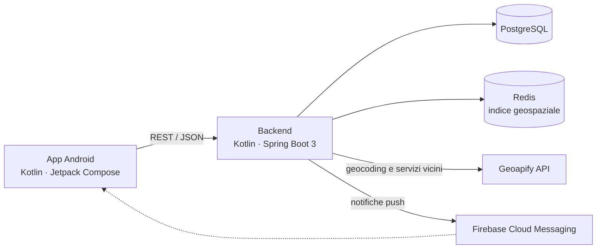
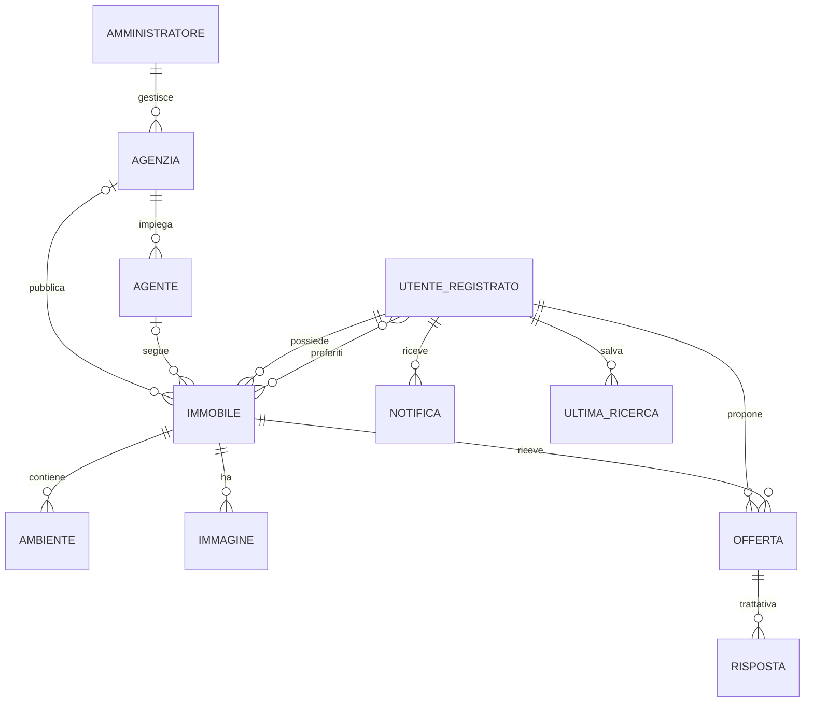

# DietiEstates25 — Backend

Backend REST della piattaforma immobiliare **DietiEstates25**, sviluppato in Kotlin con Spring Boot 3. Gestisce utenti, agenzie, immobili, offerte e trattative, e serve l'app Android del progetto.


> Progetto universitario sviluppato in team all'Università degli Studi di Napoli Federico II.
> App Android: [UninaEstatesApplication](https://github.com/LucaPagan/UninaEstatesApplication)

---

## Panoramica

La piattaforma mette in contatto chi vende o affitta un immobile, le agenzie e chi cerca casa. Il backend gestisce tre tipi di utenza, ognuno con il proprio ruolo in Spring Security:

| Ruolo | Cosa può fare |
|---|---|
| **Amministratore** | Crea agenzie, agenti e altri amministratori |
| **Agente / Manager** | Accetta o rifiuta gli incarichi sugli immobili, gestisce offerte e trattative, crea sotto-agenti, consulta una dashboard con le statistiche |
| **Utente** | Pubblica immobili, cerca con filtri o su mappa, salva preferiti, fa offerte e controproposte, riceve notifiche push |

## Architettura



Il codice segue una struttura a livelli: **controller** (endpoint REST) → **service** (logica di business) → **repository** (Spring Data JPA) → **entity** (mapping JPA delle tabelle).

## Scelte tecniche principali

- **Ricerca avanzata con JPA Specification.** I filtri (vendita o affitto, prezzo, metri quadri, stato dell'immobile, numero di locali e bagni, testo libero) vengono combinati dinamicamente in un'unica query. Locali e bagni si contano con subquery sugli ambienti dell'immobile.
- **Ricerca su mappa con Redis GEO.** Le coordinate degli immobili sono salvate in un indice geospaziale Redis, così la ricerca "entro N km da qui" non pesa sul database. Redis gestisce anche l'autocompletamento delle città.
- **Geocoding con Geoapify.** Gli indirizzi vengono convertiti in coordinate al momento della pubblicazione, e per ogni immobile si verifica la presenza di parchi, scuole e trasporti pubblici nelle vicinanze.
- **Notifiche push con Firebase Cloud Messaging.** Ogni utente sceglie quali notifiche ricevere (aggiornamenti sulle trattative, pubblicazione dei propri immobili, nuovi immobili nelle zone di interesse).
- **Sicurezza.** Spring Security con autorizzazione per ruolo e password salvate con hashing BCrypt.
- **Gestione errori centralizzata** tramite `@ControllerAdvice`, per risposte di errore uniformi.
- **Qualità del codice** analizzata con SonarQube.

## Modello dei dati



## API principali

| Area | Endpoint |
|---|---|
| Autenticazione | `POST /auth/register` · `POST /auth/login` · `POST /api/admin/login` |
| Immobili | `GET /api/immobili` (ricerca con filtri) · `GET /api/immobili/{id}` · `POST /api/immobili` (multipart, con immagini) · `PUT /api/immobili/{id}` · `DELETE /api/immobili/{id}` · `GET /api/immobili/cities` |
| Immagini | `GET /api/immagini/{id}/raw` · `POST /api/immobili/{id}/immagini` · `DELETE /api/immobili/immagini/{imageId}` |
| Offerte e trattative | `POST /api/offerte` · `GET /api/trattative/utente/{userId}` · `GET /api/trattative/{offertaId}/storia` · `POST /api/trattative/utente/rispondi` · `POST /api/risposte` |
| Agenti | `GET /api/agenti/richieste` · `POST /api/agenti/richieste/{id}/accetta` · `POST /api/agenti/richieste/{id}/rifiuta` · `POST /api/agenti/create-sub-agent` · `GET /api/manager/dashboard/{agenteId}` |
| Amministrazione | `POST /api/admin/create-agency` · `POST /api/admin/create-agent` · `POST /api/admin/create-admin` · `POST /api/admin/change-my-password` |
| Notifiche e ricerche | `POST /api/notifications/token` · `PUT /api/notifications/preferences` · `GET /api/notifiche/utente/{userId}` · `GET /api/ricerche` · `DELETE /api/ricerche` |

Tutti gli endpoint, tranne login, registrazione e immagini, richiedono l'header `Authorization: Bearer <token>`.

## Avvio in locale

**Prerequisiti:** JDK 17, Docker (per PostgreSQL e Redis), una chiave API gratuita di [Geoapify](https://www.geoapify.com/). Facoltativo: un service account Firebase per le notifiche push.

1. Avvia database e Redis:

   ```bash
   docker run -d --name dieti-postgres -e POSTGRES_PASSWORD=postgres -p 5432:5432 postgres:16
   docker run -d --name dieti-redis -p 6379:6379 redis:7
   ```

2. Imposta le variabili d'ambiente (nessuna credenziale è salvata nel repository):

   ```bash
   export DB_URL=jdbc:postgresql://localhost:5432/postgres
   export DB_USERNAME=postgres
   export DB_PASSWORD=postgres
   export GEOAPIFY_API_KEY=la-tua-chiave
   export ADMIN_DEFAULT_PASSWORD=scegli-una-password
   export DDL_AUTO=update   # crea le tabelle al primo avvio in locale
   ```

3. Avvia il backend:

   ```bash
   cd backend
   ./gradlew bootRun
   ```

Il server parte su `http://localhost:8080`. Al primo avvio viene creato un amministratore con email `admin` e la password scelta in `ADMIN_DEFAULT_PASSWORD`.

Per le notifiche push, scarica il file del service account dalla console Firebase e salvalo come `backend/src/main/resources/firebase-service-account.json` (è già escluso da Git). Senza questo file il backend funziona normalmente, ma le notifiche push sono disattivate.

## Struttura del progetto

```
backend/src/main/kotlin/com/dieti/backend/
├── controller/    endpoint REST
├── service/       logica di business, Redis GEO, Geoapify, Firebase
├── repository/    interfacce Spring Data JPA
├── entity/        entità JPA
├── SecurityConfig.kt, SimpleAuthFilter.kt
├── RedisConfig.kt, FirebaseConfig.kt
├── ImmobileSpecification.kt   filtri dinamici di ricerca
└── GlobalExceptionHandler.kt
```

## Limiti noti e sviluppi futuri

- **Autenticazione semplificata.** Il token inviato dal client è l'identificativo dell'utente. Il passo successivo è sostituirlo con JWT firmati e con scadenza, integrati nel filtro di Spring Security già presente.
- **Test automatici.** Le dipendenze per i test (JUnit e MockK) sono già configurate, ma i test non sono ancora attivi nella build.
- **Cache.** Il cache manager Redis è configurato ma non ancora applicato agli endpoint. Il prossimo passo è usarlo con `@Cacheable` sulle letture più frequenti.
- **Immagini.** Sono salvate nel database come dati binari. In produzione andrebbero spostate su uno storage dedicato.
- **Containerizzazione.** Un `docker-compose.yml` permetterebbe di avviare backend, database e Redis con un solo comando.

## Team

Progetto sviluppato da **Danilo Scala** ([@Danilo-Scala](https://github.com/Danilo-Scala)) e **Luca Pagano** ([@LucaPagan](https://github.com/LucaPagan)).
